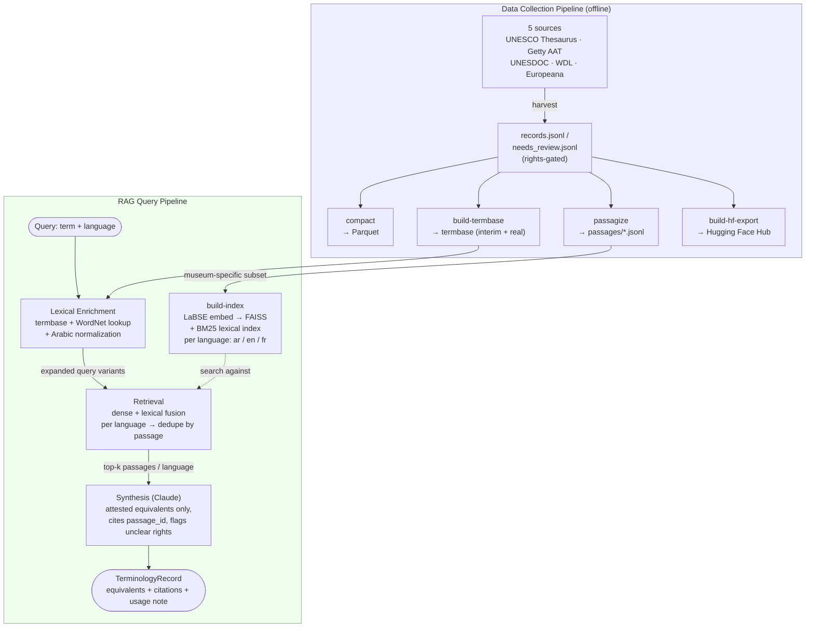

# LAD — Term-Centric Multilingual RAG for Museum Terminology Discovery
## Project Status & Handover Report

**Scope:** A multilingual (Arabic / French / English) cultural-heritage data pipeline, and a term-centric retrieval-augmented generation (RAG) system built on top of it for museum terminology discovery.
**Report date:** 2026-08-11

---

## 1. Executive Summary

The project has two working subsystems: a **data collection pipeline** (five harvested sources, a derived terminology base, a chunked passage corpus) and a **RAG system** (lexical query expansion, cross-lingual retrieval, structured synthesis) built on top of it. Both are implemented, unit-tested, and validated against real data and a live LLM.

Retrieval quality was the main focus of investigation. Three real, measured findings drove most of the work:

1. **The real Louvre Abu Dhabi Termbase** (an institutional Kalcium export, 4,652 concepts) was integrated into lexical query expansion, replacing near-total reliance on a public-data substitute with zero Arabic coverage. This roughly doubled blended retrieval quality and produced a 5–7x gain specifically for Arabic-sourced queries (Section 5.2).
2. **A structural short-passage problem** was identified as the largest single contributor to low retrieval scores: 75% of the public-data index consists of bare, duplicated, context-free labels (e.g. Getty AAT concepts with no descriptive text) that dominate top-ranked results regardless of query relevance. Two fix attempts (filtering, embedding-model substitution) failed or under-delivered; a hybrid dense-plus-lexical (BM25) retrieval scheme, fused via Reciprocal Rank Fusion, resolved it decisively (Section 5.5).
3. **A cross-lingual query-expansion bug** silently skipped retrieval entirely for any target language the termbase/WordNet didn't cover — affecting 96% of a real-term sample for Arabic. Fixed (Section 5.3).

The RAG synthesis component was validated end-to-end against a live Claude model for the first time in this reporting period. Two real defects were found and fixed during that validation (a response-parsing bug and an insufficient token budget), reducing the live synthesis error rate from 73.5% to 0%. The most recent full evaluation run was interrupted by Anthropic account credit exhaustion, not a code defect, with 363 of 635 gold-set terms completed (Section 6.2).

**Not yet validated live:** the tRAG-style generate-then-rank component (Section 7) and a multi-model comparison harness are built and unit-tested but have never been run against a real LLM.

The system, its evaluation methodology, and every reported number are reproducible via the CLI documented in Appendix B.

---

## 2. Related Work

The RAG design deliberately combines methods from two published papers, applied to a target architecture specified by a third:

- **tRAG** — Lee, D., Kim, J., Kim, J., Hwang, S., & Park, J. (2025). *tRAG: Term-Level Retrieval-Augmented Generation for Domain-Adaptive Retrieval.* NAACL 2025 (Long Papers), pp. 6566–6578. Contributes the **term-centric retrieval unit** (the term, not the document, is what is retrieved and ranked) and **generate-then-rank / collective verification** (Section 7).
- **Spanish Legal RAG** — Martín-Chozas, P., Calleja, P., & Rodríguez Limón, C. (2025). *Terminology Enhanced Retrieval Augmented Generation for Spanish Legal Corpora.* LDK 2025, pp. 147–152. Contributes the **terminology-driven query expansion** pattern (Section 5.1) and the comparison-harness evaluation style referenced in Section 9.
- **Target architecture** — an anonymized paper, *Term-Centric Multilingual RAG for Museum Terminology Discovery*, specifies the 4-component pipeline (corpus → lexical enrichment → cross-lingual retrieval → synthesis), the per-language top-k retrieval requirement, and the Louvre Abu Dhabi Termbase as the intended terminology resource.

---

## 3. System Architecture



The data collection pipeline runs offline and is rebuilt only when source data changes. The query pipeline is the real-time path: everything from `Q` (a term submitted by a user) to `K` (the structured output) executes per query.

---

## 4. Data Assets

### 4.1 Harvested Sources

Five sources, harvested through a shared connector interface providing retry logic, rate limiting, checkpointed resume, and rights classification:

| Source | Records | Rights-clear | Notes |
|---|---:|---:|---|
| UNESCO Thesaurus | 4,499 | 100% | Fully trilingual by construction |
| Getty AAT | 53,200 | 100% | English/French only — the source contains no Arabic labels |
| UNESDOC | 285,433 | 0%* | Flagged "needs review," not restricted — the API exposes no rights field |
| World Digital Library | 21,099 | 0%* | Same as above; a live, growing collection |
| Europeana | 1,000 | 52% | French-filtered; the source contains no Arabic content |
| **Total** | **365,231** | **15.9%** | |

### 4.2 Terminology Resources

Two termbases are merged at lexical-enrichment time:

- **Real termbase** (`data/termbase/real_termbase.jsonl`, `lad_termbase_real`): parsed from the institutional Louvre Abu Dhabi Kalcium terminology-management export (`data/Export from Kalcium.xlsx`, gitignored — not distributed publicly). 4,652 concepts. Coverage: Arabic 4,652/4,652 (100%), English 4,650/4,652, French 4,628/4,652 — essentially fully trilingual. Marked `reuse_risk=restricted` and excluded from the public Hugging Face export.
- **Interim termbase** (`data/termbase/interim_termbase.jsonl`, `lad_termbase_interim`): 53,355 entries, keyword-filtered from UNESCO Thesaurus and Getty AAT, built as a public-data substitute before the real termbase was integrated. Of these, 53,200/53,355 (99.7%) originate from Getty AAT and therefore have **zero** Arabic labels. Still contributes lexical coverage for concepts outside the 4,652 curated in the real termbase.

### 4.3 Passage Corpus

`pipeline/passagize.py` chunks harvested records into 150–200 token retrieval units (with Arabic normalization applied), producing 467,542 passages across all five sources. The RAG index currently covers the **museum-specific subset** only — Getty AAT, UNESCO Thesaurus, Europeana, and World Digital Library — with UNESDOC's 370,990 administrative/policy passages excluded to keep retrieval signal clean (candidate for re-inclusion, see Section 9).

### 4.4 LAD Publications (Institutional Documents)

Five real Louvre Abu Dhabi publication PDFs were ingested to close the "no real institutional documentation" gap: the *LAD Architecture Book* (Arabic/English/French editions, 36 pages each) and *LAD LUXE* (English/French, 121 pages each). `pipeline/ingest_lad_publications.py` extracts text page-by-page (verified: all five PDFs have real extractable text layers, no OCR required) and reuses the existing passagization logic unchanged.

Result: 317 of ~350 pages yielded extractable text (the remainder are image-only covers/dividers), producing 770 passages (39 Arabic, 360 English, 371 French — Arabic is thin because only the Architecture Book has an Arabic edition). These are indexed separately as `labse-plus-lad-publications` (dense) and `lexical-plus-lad-publications` (BM25), so the augmented index can be A/B-tested against the baseline museum-subset index without disturbing it.

### 4.5 Evaluation Gold Sets

Two gold sets, built by different methods:

- **Main gold set** (`data/eval/gold_set.jsonl`, 120 terms): sampled from the real termbase, rotating source language round-robin across Arabic/English/French. Because every entry is termbase-derived, every gold term has a termbase-provided translation in every target language by construction — this is a known limitation for testing components that only activate when termbase coverage is *absent* (Section 5.3, Section 7).
- **LAD Publications gold set** (`data/eval/lad_publications_gold_set.jsonl`, 635 terms): built independently — each entry requires a real termbase label to be *confirmed present* (substring match) in the actual LAD Publications text, per language. 635 entries have attestation in ≥2 languages; only 18 have attestation in all three. **All 635 entries are English-sourced** (`source_language: "en"`) — this gold set has never exercised Arabic- or French-sourced retrieval or synthesis, which was not documented at the time it was built and should be accounted for when interpreting results in Section 6.2.

---

## 5. Retrieval System

### 5.1 Baseline Design and Initial Results

The retrieval system follows **tRAG's (Lee et al., 2025) term-as-retrieval-unit principle**: a query is a term plus its source language, not a document. Three stages:

1. **Lexical enrichment** (static): the termbase, WordNet cross-lingual synonyms, and Arabic morphological normalization expand the source term into query variants per target language — **the Spanish Legal RAG paper's (Martín-Chozas et al., 2025) terminology-driven query-expansion pattern**.
2. **Retrieval**: LaBSE embeddings, with one FAISS index *per language* rather than one mixed index — required to guarantee top-k results per language, a retrieval requirement specified by the **target architecture paper**, since a single combined index returns globally-nearest neighbors regardless of language.
3. **Synthesis**: see Section 6.

At initial build (78,679 passages after language filtering), a retrieval-only evaluation against 45 auto-sampled gold terms gave a blended P@5 = 0.507, R@10 = 0.803, MRR = 0.795. This average concealed a large language gap:

| Target language | n | P@5 | R@10 | MRR |
|---|---:|---:|---:|---:|
| French | 45 | 0.656 | 0.933 | 0.933 |
| Arabic | 16 | 0.088 | 0.438 | 0.406 |

Arabic P@5 was roughly 7x worse than French, consistent with the target architecture paper's own central finding. Root causes: the Arabic FAISS bucket is the smallest language partition (5,038 passages vs. 59,745 English at the time), and the termbase in use at that point could barely expand Arabic queries (99.7% of its entries came from Getty AAT, which has no Arabic labels).

### 5.2 Real Termbase Integration

The real Louvre Abu Dhabi Termbase (`data/Export from Kalcium.xlsx`) was present in the repository but unreferenced by any code prior to this work. `pipeline/build_termbase_from_kalcium.py` parses its actual layout — two header rows, one row per concept, 74 columns (11 concept-level fields plus three 21-column per-language blocks) — filtering one stray repeated header row by requiring an integer concept ID. Broader/narrower/related-concept fields are `<br/>`-joined display labels in this export rather than concept IDs, and are stored as label strings for lexical-enrichment use.

`rag/lexical_enrichment.py` merges the real and interim termbases into one lookup index. The gold set was rebuilt to prefer the real termbase (target size raised 50 → 120) and to rotate source language round-robin across Arabic/English/French — the previous gold set was 100% English-sourced and never exercised Arabic- or French-sourced retrieval at all.

A controlled A/B (same 120-term gold set and passage index; only termbase access toggled) isolated the termbase's effect from corpus content:

| Direction | P@5 without real termbase | P@5 with real termbase | Change |
|---|---:|---:|---:|
| ar→en | 0.005 | 0.037 | 7.4x |
| ar→fr | 0.010 | 0.053 | 5.3x |
| en→fr | 0.050 | 0.065 | +30% |
| fr→en | 0.035 | 0.035 | flat |
| en→ar | 0.000 | 0.000 | flat |
| fr→ar | 0.005 | 0.005 | flat |
| **Blended** | **0.018** | **0.033** | **+83%** |

The real termbase dramatically improves Arabic-**as-source** retrieval (query expansion into found variants), because that is exactly what real Arabic labels enable. It has no effect on Arabic-**as-target** retrieval, since the termbase adds query variants, not passages — the Arabic passage index remained the bottleneck (5,038 vs. 59,745 English passages), confirming that corpus expansion, not further lexical enrichment, is the remaining lever for that gap (Section 9).

The absolute numbers here are lower than Section 5.1's baseline (0.507 blended P@5) by design, not regression: the earlier evaluation was 100% English-sourced, auto-sampled from the same public-data substitute the retrieval corpus was built from — an easier, self-referential test. This evaluation draws real institutional labels, tests all three source-language directions, and searches a corpus that is still public data rather than Louvre-institutional documentation, so real LAD terminology often does not appear verbatim in the indexed passages.

### 5.3 Cross-Lingual Query Fallback Bug

Found while scoping the generate-then-rank component (Section 7): `expand_query()` in `rag/lexical_enrichment.py` added the bare source term only to its own language's variant set. A target language with no termbase/WordNet match was left with an empty set and then **dropped from the returned dictionary entirely**. Since `retrieve()` only iterates the languages `expand_query()` returns, this meant `index.search()` was never called for that language — not degraded retrieval, but no retrieval attempt at all. This defeated a property the **target architecture paper (§3.3)** specifies directly: that a query in one language should retrieve attesting passages in another "without explicit translation," relying on LaBSE's cross-lingual embedding space rather than a termbase lookup.

The 120-term gold set never surfaced this, because it is termbase-derived by construction and every gold term already has a translation in every target language (verified: 0 of 240 source→target pairs were missing one, even before the fix). The bug only affects terms outside the curated termbase. On a sample of 500 real Getty AAT English terms, 96% had zero Arabic query variants and 80% had zero French query variants under the pre-fix logic.

**Fix:** `expand_query()` now unconditionally adds the bare term to every language's variant set. This is purely additive to the existing pooling/deduplication logic in `retrieval.py` and cannot remove a hit that termbase/WordNet expansion would otherwise have found. Confirmed live: the same 500-term sample now has zero terms missing a language.

This restores the retrieval *attempt* — it does not manufacture corpus coverage that isn't there. Spot-checking out-of-termbase queries (e.g. "crackle glaze," "deaccessioning," "sgraffito") confirms Arabic passages are now retrieved where none were attempted before, though their topical relevance is mixed, consistent with the thin Arabic corpus already documented. The gold set's aggregate metrics cannot measure this fix's effect directly, since every gold term is termbase-covered by construction — a known limitation of that evaluation design.

### 5.4 Cross-Encoder Reranking

Both source papers include a cross-encoder reranking step (**Lee et al., 2025; Martín-Chozas et al., 2025**). `rag/rerank.py` wraps `cross-encoder/mmarco-mMiniLMv2-L12-H384-v1` (chosen over an English-only cross-encoder for Arabic/French support), wired into `retrieve()` as an opt-in `reranker` parameter and exposed as `--rerank`.

Verified before deployment: the cross-encoder scores same-language pairs reliably (Arabic query "تذهيب" vs. a relevant Arabic passage: +0.63; vs. an irrelevant one: −4.33) but is not reliably cross-lingual (the English query "gilding" against that same relevant Arabic passage scores −2.04) — mMARCO's training data is monolingual per language, not cross-lingual pairs. Each hit is therefore reranked against its own same-language query variant rather than the original source term.

A controlled A/B (same gold set, index, and termbase state) showed reranking *hurt* blended P@5 by 18% — the opposite of both source papers' own ablation results:

| Direction | P@5 without reranker | P@5 with reranker | Change |
|---|---:|---:|---:|
| ar→en | 0.037 | 0.037 | flat |
| ar→fr | 0.053 | 0.038 | −28% |
| en→ar | 0.000 | 0.000 | flat |
| en→fr | 0.065 | 0.060 | −8% |
| fr→ar | 0.005 | 0.005 | flat |
| fr→en | 0.035 | 0.020 | −43% |
| **Blended** | **0.033** | **0.027** | **−18%** |

To rule out a metric artifact — the possibility that the strict, exact-substring `precision_at_k` was penalizing a reranked result that is semantically correct but differently phrased — a companion metric, `semantic_relevance_at_k` (cosine similarity between the reference label and the closest top-k passage), was added and the A/B repeated:

| Direction | P@5 (no rerank → rerank) | SemRel@5 (no rerank → rerank) |
|---|---:|---:|
| ar→en | 0.037 → 0.037 | 0.632 → 0.611 |
| ar→fr | 0.053 → 0.038 | 0.661 → 0.648 |
| en→ar | 0.000 → 0.000 | 0.663 → 0.609 |
| en→fr | 0.065 → 0.060 | 0.690 → 0.663 |
| fr→ar | 0.005 → 0.005 | 0.630 → 0.581 |
| fr→en | 0.035 → 0.020 | 0.627 → 0.603 |
| **Blended** | **0.033 → 0.027** | **0.651 → 0.619** |

Semantic relevance dropped in every direction, including en→ar and fr→ar where P@5 was already flat at zero in both conditions — a degradation the strict metric could not have shown either way. This confirms the regression is real, not a scoring artifact. Likely cause: mMARCO's web-search-style training domain does not transfer well to short-term/short-passage terminology attestation, and/or the widened pre-rerank candidate pool admits borderline passages whose survival depends on a judgment the model isn't calibrated for.

**Decision:** kept off by default (`--rerank` opt-in). Candidates for revisiting: a cross-encoder trained for short-query/short-passage matching, or blending cross-encoder and embedding scores instead of fully replacing one with the other; also worth re-testing on top of the fused retrieval pool introduced in Section 5.5, since the original failure may be partly attributable to the same short-passage noise resolved there.

### 5.5 The Short-Passage Problem

#### Discovery

The LAD Publications ingestion (Section 4.4) was expected to measurably improve retrieval by adding real institutional content. A controlled A/B (both gold sets, baseline index vs. index + publications) instead showed **zero effect**: 0 of 893 evaluated (term, target-language) pairs changed at all.

This null result was investigated rather than accepted at face value. For the gold-set entry "Abbot" → French "Abbé" (independently confirmed present in the publications text), the correct passage was confirmed present in the expanded index's metadata but never appeared in retrieved results even at `top_k=2000`. For "gilding" → French "dorure," the two genuinely relevant publications passages ranked 8,632nd and 12,257th out of 14,267 French passages by embedding similarity. The actual top-5 results for that query were five *different* Getty AAT entries whose entire text is the single unrelated word "tuile" (French for "tile"), all scoring identically.

**Root cause:** Getty AAT has 0% `scope_note` coverage in either English or French — every one of its 60,436 passages falls back to a bare `pref_label` (the passagization logic chunks `scope_note` when present, falling back to `pref_label` otherwise; AAT never has a `scope_note`). 74% of Getty AAT's English (and equivalent French) passages are ≤2 whitespace tokens — bare labels, not passages in any meaningful sense, frequently duplicated (28 separate AAT concepts share the literal string "tuile"). Across the entire museum-subset index (96,552 passages, all four public sources combined), 75% are ≤3 tokens. LaBSE, a sentence-embedding model, appears to embed short, context-free label fragments into a poorly-separated region of its vector space, where they score spuriously high similarity regardless of true relevance.

This is very likely the single largest contributor to the project's low absolute retrieval numbers — larger than the termbase gap or the Arabic corpus-size gap — because it affects every configuration equally and therefore could not be surfaced by any prior relative A/B on the same index. It required an independently-verified gold set and row-level inspection of raw results, not just averaged summaries, to catch.

#### Failed Fix 1: Filtering and Deduplication

`rag/passage_quality.py` excludes a passage if it originates solely from a `pref_label` fallback (a direct signal, not inferred from length) or falls below a minimum token count, and separately collapses exact-duplicate text. Both were measured as opt-in `build_index()` parameters against both gold sets:

| Configuration | Main P@5 | Main SemRel@5 | Publications P@5 | Publications SemRel@5 |
|---|---:|---:|---:|---:|
| Baseline (unchanged) | 0.030 | 0.644 | 0.084 | 0.671 |
| Filtered (exclusion + dedup) | 0.011 | 0.334 | 0.031 | 0.340 |
| Dedup-only | 0.030 | 0.642 | 0.078 | 0.670 |

**Filtering is a clear regression**, roughly halving every metric. The field-source exclusion removes 100% of Getty AAT and 86% of UNESCO Thesaurus. Both gold sets are drawn from real terminology full of simple, common museum vocabulary that Getty AAT's short controlled-vocabulary labels correctly match (e.g. "ceramic" → "céramique" scored a perfect 1.0 P@5 in the baseline via exactly this kind of short match). Removing all short/label-only passages removes a large amount of genuinely correct signal along with the noise.

**Deduplication alone is neutral** — statistically indistinguishable from baseline despite collapsing the English passage count from 59,745 to 7,005. Duplicate count was never the actual mechanism: a single un-duplicated "tuile" entry scores the same spuriously-high similarity to "dorure" that 28 duplicates did. Deduplication changes how many top-ranked slots a wrong answer occupies, not whether it can outrank a correct longer passage in the first place.

**Conclusion:** the short-passage-dominance finding stands, but "short passages are bad" is not uniformly true — many short passages are exactly correct matches for the terms they represent. A blanket rule by length, field source, or duplication cannot distinguish a relevant short passage from a spurious one, because both are structurally identical from the passage's own metadata. Both options were left disabled by default.

#### Failed Fix 2: Alternate Embedding Model

Before building a more involved fix, a cheaper hypothesis was tested: is the failure mode specific to LaBSE (a 2022 model), or general to dense sentence embeddings applied to short text? `BAAI/bge-m3` was the preferred candidate (native dense+sparse hybrid support) but its repository ships only a legacy `pytorch_model.bin` with no safetensors file, incompatible with the installed `transformers` version without a torch upgrade — deliberately avoided to protect the environment's GPU-pinned setup. `intfloat/multilingual-e5-large` was used instead.

The same "dorure" query against a fully-rebuilt e5 index still returned unrelated short entries at the top ("Reliure"/bookbinding, "Drame"/drama, "tuile de drainage"/drainage tile) — different specific culprits, identical failure mode:

| Model | Main P@5 | Main R@10 | Main MRR | Publications P@5 | Publications R@10 | Publications MRR |
|---|---:|---:|---:|---:|---:|---:|
| LaBSE (baseline) | 0.030 | 0.100 | 0.091 | 0.084 | 0.256 | 0.191 |
| multilingual-e5-large | 0.032 | 0.113 | 0.102 | 0.088 | 0.257 | 0.193 |

A small, consistent gain (a few percent), not a fix. This is evidence the short-text embedding degeneracy is a property of dense sentence-embedding retrieval in general when applied to context-free short strings, not a LaBSE-specific defect. Not adopted as the default; `bge-m3` remains untested pending a compatible loading path.

#### Successful Fix: Hybrid Dense + Lexical Retrieval

Both prior attempts pointed to the same conclusion: dense similarity alone is unreliable for short, context-free strings, and no passage-level metadata can distinguish a spuriously-scoring short passage from a genuinely correct one. The fix adds a second, independent signal — lexical/exact-term overlap — reliable in exactly the cases where dense similarity is not.

`rag/lexical_index.py` builds one BM25 index per language from the same passage files the dense index reads. `reciprocal_rank_fusion()` combines a dense ranking and a lexical ranking by rank (not raw score, since BM25 and cosine similarity are on incomparable scales), using the standard RRF constant k=60. Wired into `retrieve()` as an opt-in `lexical_index` parameter, exposed as `--lexical`.

Diagnostic: the baseline museum-subset corpus contains zero French passages with the string "dorure" at all — explaining why no retrieval method could find a correct answer there; the relevant content exists only in the LAD-publications-expanded index. Against that expanded index, the real gilding passage — previously absent from the dense-only top-5, buried past rank 8,000 — appeared in the fused top-5, though only tied for first place (plain RRF discards BM25's score magnitude, so a passage that wins decisively on the lexical side is not weighted more heavily than one that barely wins on the dense side).

Full comparison across every retrieval configuration tested, both gold sets:

| Configuration | Main P@5 | Main R@10 | Main MRR | Publications P@5 | Publications R@10 | Publications MRR |
|---|---:|---:|---:|---:|---:|---:|
| Baseline (LaBSE) | 0.030 | 0.100 | 0.091 | 0.084 | 0.256 | 0.191 |
| + LAD publications only | 0.030 | 0.100 | 0.091 | 0.084 | 0.256 | 0.191 |
| Filtered | 0.011 | 0.037 | 0.027 | 0.031 | 0.133 | 0.081 |
| Dedup-only | 0.030 | 0.100 | 0.091 | 0.078 | 0.256 | 0.191 |
| multilingual-e5-large | 0.032 | 0.113 | 0.102 | 0.088 | 0.257 | 0.193 |
| **Hybrid dense + lexical** | **0.055** | **0.163** | **0.114** | **0.216** | **0.662** | **0.373** |

A decisive result. On the main gold set: P@5 +83%, R@10 +63%, MRR +25% over baseline. On the LAD Publications gold set — built specifically to test whether the system finds terms independently confirmed present in the real corpus — P@5 more than doubled (+157%), R@10 +158%, MRR +95%. The larger gain there is expected, not incidental: that gold set is built on lexical substring confirmation, which is exactly the condition BM25 exploits.

This is the first approach in the investigation that resolved the underlying mechanism rather than trading it for a different problem. It remains opt-in (`--lexical`) pending a synthesis-inclusive validation pass; promoting it to the default, re-testing reranking (Section 5.4) on a fused candidate pool, and tuning the RRF constant are the recommended next steps (Section 9).

---

## 6. Synthesis System

### 6.1 Design

`rag/synthesis.py` sends the retrieved passages (top 5 per language) to Claude with a structured, attested-equivalents-only prompt, producing a `TerminologyRecord`: per-language equivalents, each backed by cited `passage_id`s, plus a usage note and a rights caveat surfaced whenever a cited passage's rights are not confirmed clear. The output schema and the "attested equivalents only, cite evidence" constraint follow the **target architecture paper's §3.4 synthesis specification** directly.

### 6.2 Live Validation and Bug Fixes

Prior to this reporting period, synthesis had been validated only against a stub Claude client — real coverage of the JSON-parsing and record-construction logic, but no proof the live API integration worked end to end. Once a live API key became available, the full retrieval-plus-synthesis pipeline was run against the LAD Publications gold set (635 terms, hybrid retrieval, publications-augmented index), surfacing two real defects.

**Diagnostic capability required first:** the evaluation runner's synthesis error handling counted exceptions but discarded them (`except Exception: errors += 1`), so an initial run with a 24% synthesis failure rate gave no way to determine the cause. This was fixed to capture the exception type and message per failure, which made both defects below diagnosable rather than a matter of guesswork.

**Defect 1 — response parsing assumed the wrong content block.** The first full live run failed on 467 of 635 synthesis calls (73.5%), every failure identical: `AttributeError: 'ThinkingBlock' object has no attribute 'text'`. `synthesize()` assumed the model's first response content block was always the answer text; in practice the model returns a leading extended-thinking block before the answer, and indexing the first block retrieved the thinking block instead. Fixed by scanning the response for the block of type `"text"` rather than assuming position. (The same defect existed in the not-yet-live-tested generate-then-rank generator and was fixed pre-emptively.) After the fix, the error rate dropped to 63/635 (9.9%).

**Defect 2 — the token budget did not account for thinking.** The remaining 63 failures were the same underlying cause in two forms: 20 calls exhausted their entire token budget on the thinking block and produced no answer at all; 43 were cut off mid-response, producing invalid JSON. Fixed by raising `max_tokens` from 1500 to 4096 (and, pre-emptively, in the generate-then-rank generator). A subsequent full run produced zero thinking- or truncation-related errors, confirming the diagnosis.

**Remaining blocker: Anthropic account credit exhaustion, not a code defect.** The next full run completed 363 of 635 terms with zero errors before every subsequent call failed identically on an API billing error (insufficient credit balance). This is an account state, not a defect in the system.

Error-rate progression across the three live runs:

| Run | Synthesis errors | Cause | Completed rows | equivalence_correctness | attestation_accuracy |
|---|---:|---|---:|---:|---:|
| 1 (before fixes) | 467/635 (73.5%) | Response-parsing defect | 168/635 | 0.049 | 0.099 |
| 2 (after Defect 1 fix) | 63/635 (9.9%) | Token-budget defect | 572/635 | 0.538 | 0.664 |
| 3 (after both fixes) | 272/635 (42.8%) | Account credit exhaustion (271/272) | 363/635 | 0.576 | 0.749 |

On the 363 rows completed with no code-level errors in run 3, the first genuine (non-stub) synthesis-quality result for this project: **equivalence_correctness 0.576, attestation_accuracy 0.749**. This is not a random sample of the full 635 — it reflects whichever terms were processed before the account ran out of credit — and should be treated as a strong signal rather than a final figure. Retrieval metrics, unaffected by any of this (deterministic, no LLM call involved), reproduced exactly across all three runs and matched the figures reported in Section 5.5: P@5 0.216, R@10 0.662, MRR 0.373.

Both defects are fixed and confirmed resolved (zero recurrence in run 3). Completing the remaining 272 terms requires only an account credit top-up and a re-run — the evaluation runner has no resume/checkpoint capability yet, so a re-run currently re-processes all 635 terms rather than only the unfinished ones (see Section 9).

---

## 7. tRAG Generate-Then-Rank (Built, Not Yet Validated Live)

Section 5.3's fix restores retrieval attempts for languages the termbase/WordNet don't cover, but does not improve what is found when the corpus itself is thin. **tRAG's (Lee et al., 2025) second core contribution** — generate-then-rank with **collective verification** — addresses this: for a target language with no static (termbase/WordNet) translation, an LLM generates candidate terminology variants, each of which must then be verified against the actual passage corpus (FAISS similarity above a threshold) before being trusted. This mirrors tRAG's own finding that verifying a candidate against the whole corpus, rather than any single document, is what makes generated candidates trustworthy.

`rag/generate_expand.py` implements this behind a `TextGenerator` protocol with two backends: `ClaudeGenerator` (same credential as synthesis) and `Jais2Generator`, wrapping `inceptionai/Jais-2-8B-Chat` — confirmed to exist (released January 2026, Apache-2.0, bilingual Arabic/English, 8B parameters), chosen specifically for Arabic generation quality, and confirmed to be a gated repository requiring an accepted-license Hugging Face token. The mechanism is purely additive: a language with real static coverage is untouched, and a language where no generated candidate verifies is left exactly as Section 5.3's bare-term fallback already had it.

This component is built and unit-tested against a stub generator (both live-synthesis defects from Section 6.2 were pre-emptively fixed here as well, given the identical call pattern), but **has never been run against a real model**. Neither an Anthropic API key nor a licensed Hugging Face token for Jais-2 was available during development. Whether generated-and-verified candidates measurably improve retrieval, and whether Claude or Jais-2 performs better for Arabic specifically, remain open questions — exactly what the comparison harness (Section 9) is intended to answer once credentials are available.

Note: the main 120-term gold set cannot exercise this component meaningfully, for the same reason noted in Section 5.3 — every gold term already has termbase-provided translations in every language by construction, so the "no static coverage" trigger condition rarely or never fires against it. Validating this component requires either terms outside the termbase or a purpose-built gold set.

---

## 8. Known Limitations

- **Arabic-as-target retrieval** remains bottlenecked by corpus size (5,038 Arabic passages vs. 59,745 English) — confirmed in Section 5.2 to be unaffected by termbase improvements, since the termbase adds query variants, not passages.
- **The LAD Publications gold set is 100% English-sourced** (Section 4.5) — no evaluation to date has exercised Arabic- or French-sourced retrieval or synthesis against it.
- **The evaluation runner has no resume/checkpoint capability** — an interrupted run (e.g. by API credit exhaustion, Section 6.2) must be re-run from the start rather than resumed.
- **272 of 635 LAD Publications gold-set terms have not yet completed live synthesis**, pending an Anthropic account credit top-up.
- **The generate-then-rank component (Section 7) has never been run live** — neither Claude nor Jais-2 credentials were available during development.
- **The multi-model comparison harness** (second embedding model, Claude vs. Jais-2 head-to-head, ablation grid) described in the Spanish Legal RAG paper's methodology has not been built.
- **UNESDOC and World Digital Library are 100% "rights unknown"** (not restricted) because neither source API exposes a rights field.
- **The main gold set (120 terms) is auto-sampled from the termbase, not terminologist-validated** — results are a smoke-test signal, not directly comparable to published benchmarks.
- **No cross-source entity resolution** between the real and interim termbases — a concept present in both contributes independent, non-deduplicated candidates to lexical enrichment. Safe (adds recall, no false merging) but leaves redundancy unresolved.
- **Europeana harvesting is capped** at the source's free-tier `start=1000` pagination limit; full-corpus harvesting requires cursor-based pagination, not yet implemented.
- **Hybrid dense+lexical retrieval (Section 5.5) is not yet the default** — still opt-in via `--lexical`, pending a synthesis-inclusive validation pass.

---

## 9. Recommendations for Future Work

**High priority:**
1. Promote hybrid dense+lexical retrieval to the default configuration, once a synthesis-inclusive evaluation confirms no downstream regression.
2. Top up Anthropic account credits and complete the remaining 272 LAD Publications gold-set terms; consider building a `--resume-from` flag first so the re-run only pays for unfinished terms.
3. Run the generate-then-rank component live for the first time (`--generator claude` / `--generator jais2`), which requires an Anthropic API key and/or a licensed Hugging Face token for Jais-2.

**Medium priority:**
4. Expand the Arabic passage corpus — re-admit UNESDOC passages filtered for relevance against the real termbase, and/or add Arabic-native sources (e.g. Qatar Digital Library, Arabic Wikipedia/Wikidata heritage categories, Hindawi). Getty AAT and Europeana are structurally Arabic-blind, so no amount of lexical-enrichment work closes this gap without new passages.
5. Ingest additional real institutional Louvre documentation beyond the five publications currently indexed (object catalogs, curatorial text, exhibition texts) — now genuinely measurable given the hybrid retrieval fix.
6. Build the multi-model comparison harness, following **the Spanish Legal RAG paper's (Martín-Chozas et al., 2025) evaluation methodology**: a second embedding model (`bge-m3` pending a compatible loading path), Claude vs. Jais-2 as the generation backend, hybrid retrieval on/off, tabulated head-to-head.
7. Re-test cross-encoder reranking (Section 5.4) on a fused (dense+lexical) candidate pool rather than a pure-dense one — its earlier failure may be partly attributable to the same short-passage noise resolved in Section 5.5.
8. Tune the Reciprocal Rank Fusion constant, or move from pure rank fusion to a magnitude-aware blend — RRF currently under-weights a lexical match that wins decisively over a dense match that barely wins (Section 5.5).

**Lower priority:**
9. Calibrate the generate-then-rank candidate-verification similarity threshold (currently an uncalibrated 0.5) once a real generator has been run live.
10. Complete the Europeana harvest past its current pagination cap.

---

## Appendix A — Test Coverage and Environment Notes

- 155/155 tests passing project-wide as of this report.
- **GPU/Python compatibility:** this environment required a Python 3.11 virtual environment specifically — Python 3.14 has no PyTorch CUDA build compatible with the deployment driver (CUDA 12.4). GPU confirmed working (NVIDIA A40).
- **Rights classification** was fixed early in development: an initial version treated "any rights field present" as clear, which misclassified in-copyright Europeana items as reusable. Replaced with a proper open/restricted/unknown classifier and regression tests.
- **UNESDOC's paginated search API hard-caps at 10,000 results**; the harvester uses its bulk download endpoint instead to retrieve the full 285,433 records.
- **Parquet compaction** failed on struct-typed fields that are empty on every row (encountered with Getty AAT); fixed generically rather than patched for that one field.
- **Per-language FAISS indexing** was a deliberate design decision, not a default: a single mixed-language index cannot guarantee top-k results per language, since it returns globally-nearest neighbors regardless of language.

## Appendix B — CLI Reference and Reproducing Results

Numbered pipeline scripts (`scripts/00`–`12`), each independently runnable:

| Script | Purpose |
|---|---|
| `00_setup.sh` | Environment setup (Python 3.11 venv, GPU-compatible torch, dependencies) |
| `01_harvest.sh` | Harvest all five sources |
| `02_compact.sh` | Compact harvested JSONL into partitioned Parquet |
| `03_build_termbase.sh` | Build the interim (public-data) termbase |
| `03b_build_real_termbase.sh` | Parse the real Kalcium termbase export |
| `04_passagize.sh` | Chunk records into retrieval passages |
| `05_stats.sh` | Regenerate per-source statistics |
| `06_push_to_hf.sh` | Push the dataset to the private Hugging Face repository |
| `07_build_index.sh` | Build the dense FAISS index |
| `08_query.sh` | Run one term through the full pipeline |
| `09_eval.sh` | Run the gold-standard evaluation |
| `10_experiment.sh` | Interactive REPL for repeated queries without reloading models |
| `11_ingest_lad_publications.sh` | Ingest the LAD publication PDFs |
| `12_build_lad_publications_gold_set.sh` | Build the LAD Publications gold set |

Key `lad eval` / `lad query` flags for reproducing the A/B results in Section 5: `--lexical` (enable hybrid retrieval), `--rerank` (enable cross-encoder reranking), `--generator claude|jais2` (enable generate-then-rank), `--index-model-name` / `--lexical-index-name` (point at an alternate index variant, e.g. `labse-plus-lad-publications` / `lexical-plus-lad-publications`), `--gold-set-path` (use an alternate gold set), `--output-json` / `--output-csv-dir` (persist raw per-row results, not just the averaged summary).

Example — the exact command used to produce Section 6.2's results:

```bash
lad eval \
  --gold-set-path data/eval/lad_publications_gold_set.jsonl \
  --index-model-name labse-plus-lad-publications \
  --lexical --lexical-index-name lexical-plus-lad-publications \
  --output-json data/eval/results/live_publications_synthesis.json
```
