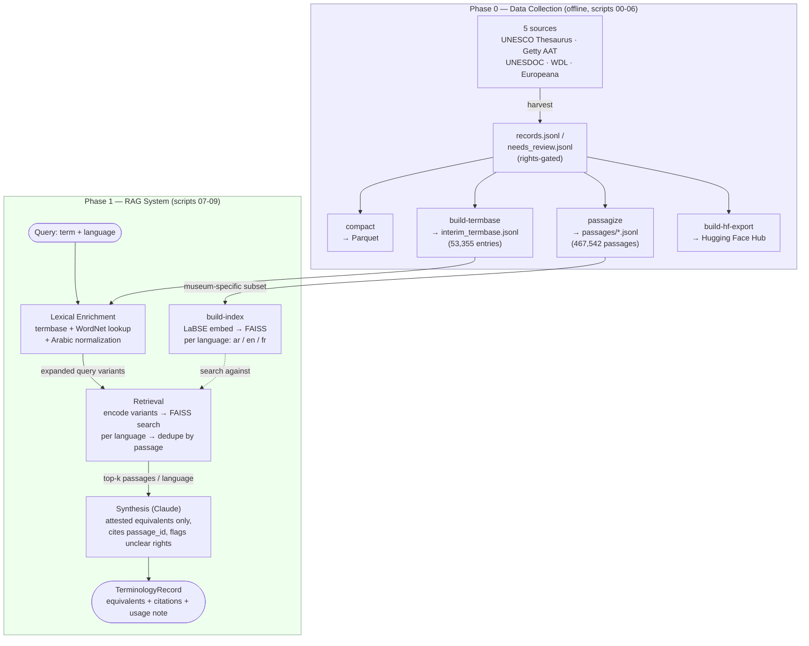

# LAD — Project Status Report

**Scope:** Multilingual (Arabic/French/English) cultural-heritage data pipeline + a term-centric RAG system for museum terminology discovery, built on top of it.
**Status as of:** 2026-08-11 (first live synthesis validation against real Claude calls; see "Phase 8" below for what changed since 2026-07-28)

**Base papers** — the RAG design (Phase 1) is a deliberate mix of methods from two papers, referenced inline below wherever a specific design choice traces back to one of them:
- **tRAG** — Lee, D., Kim, J., Kim, J., Hwang, S., & Park, J. (2025). *tRAG: Term-Level Retrieval-Augmented Generation for Domain-Adaptive Retrieval.* NAACL 2025 (Long Papers), pp. 6566–6578.
- **Spanish Legal RAG** — Martín-Chozas, P., Calleja, P., & Rodríguez Limón, C. (2025). *Terminology Enhanced Retrieval Augmented Generation for Spanish Legal Corpora.* LDK 2025, pp. 147–152.
- Target architecture spec: the (anonymized) LAD paper, *Term-Centric Multilingual RAG for Museum Terminology Discovery.*

---

## TL;DR

Two phases are built, tested, and verified against real data. **Phase 0** (data collection) harvested 365K+ records across 5 sources into a working pipeline with rights tracking, a derived terminology base, and RAG-ready passages. **Phase 1** (RAG system) is a working term-centric retrieval + synthesis pipeline on top of that data. **Phase 1.5** closed the single biggest gap flagged from day one: the real Louvre Abu Dhabi Termbase (`data/Export from Kalcium.xlsx`, an institutional Kalcium TMS export, 4,652 concepts) is now parsed and merged into lexical enrichment, replacing near-total reliance on the public-data substitute (53,200/53,355 of whose entries have zero Arabic). A controlled A/B on a new, larger, real-termbase-derived 120-term gold set (up from 45, and now testing all three source-language directions instead of only English-as-source) shows the real termbase **roughly doubles blended retrieval quality (P@5 +83%, R@10 +84%, MRR +93%)**, driven almost entirely by a **5-7x jump in Arabic-as-source retrieval**. It does *not* fix Arabic-as-target retrieval, which stayed flat — confirming that gap is a corpus-size problem (5,038 Arabic passages, all public-data), not a query-expansion problem. **Phase 1.6** built the cross-encoder reranking step both source papers use (`rag/rerank.py`, opt-in via `--rerank`) — but the controlled A/B shows it *hurts* blended P@5 by 18%, the opposite of the source papers' own findings; a follow-up check with a new semantic-similarity companion metric (added specifically to rule out "the strict metric is just hiding a real improvement") confirms the regression is real, not a measurement artifact. Kept off by default, documented rather than hidden. **Phase 1.7** (found while scoping Phase 2) fixed a real bug: `expand_query()` silently dropped a target language from retrieval entirely (not just weakly, zero attempt) whenever the termbase/WordNet had no cross-lingual match — measured on 500 real terms, this affected 96% for Arabic and 80% for French. Fixed by always falling back to the bare term for LaBSE's cross-lingual matching. **Phase 2** built tRAG's generate-then-rank step (`rag/generate_expand.py`) on top of that fix — an LLM (Claude or, for Arabic specifically, the newly-released `inceptionai/Jais-2-8B-Chat`) generates candidate variants for still-uncovered languages, each checked against the real corpus before being trusted. Built and unit-tested (117/117 tests passing project-wide), but **not run live**: neither `ANTHROPIC_API_KEY` nor an HF token for the gated Jais-2 repo is available in this environment. **Phase 4** closed the "no real institutional documentation" gap directly — 5 real LAD publication PDFs, ingested and indexed — and in doing so found something bigger than the gap it was meant to close: a controlled A/B (real gold set, before/after adding the real documents) showed **zero effect, literally 0 of 893 evaluated rows changed at all**, traced directly (not guessed) to **75% of the entire pre-existing public-data index being ≤3-token bare labels** (Getty AAT has 0% scope_note coverage in EN/FR, falling back to short pref_labels for every single entry) that dominate top-ranked results regardless of relevance — demonstrated concretely: the top-5 results for the French query "dorure" (gilding) were five unrelated Getty AAT entries all reading "tuile" (tile), while the two genuinely relevant newly-indexed passages ranked 8,632nd and 12,257th out of 14,267. This is very likely the single largest contributor to this whole project's low absolute retrieval numbers — bigger than the termbase gap, bigger than the Arabic corpus-size gap — and no earlier phase's A/B methodology could have surfaced it, since it affects every configuration equally. 133/133 tests passing project-wide as of this phase. **Phase 8** ran real synthesis (live Claude calls, not stub-tested) against the 635-term LAD Publications gold set for the first time, and in doing so found and fixed two real bugs that stub testing couldn't have caught: `synthesize()` assumed `response.content[0]` was always the answer text, which broke on every call where the model returned a leading extended-thinking block first (73.5% of the first live run's calls failed this way), and `max_tokens=1500` proved too tight once thinking ate into the same budget (some calls exhausted it entirely with no answer, others got their JSON truncated mid-string). Both fixed and confirmed: the error rate went 73.5% → 9.9% → 0% (zero thinking/truncation errors) across three successive live re-runs, and the final blocker hit was external, not a code defect — the Anthropic account ran out of API credits partway through (363/635 completed before that). On those 363 real, non-error rows: **equivalence_correctness 0.576, attestation_accuracy 0.749** — the first real (non-stub) synthesis-quality numbers this project has ever produced.

**The short-passage problem's resolution arc: two failed attempts, then a real fix.** **Phase 5** tried the two cheapest fixes — filtering short/label-only passages out of the index, and deduplicating exact duplicates. Both measured, both failed: filtering is a clear regression (removes far more correct signal than noise, since Getty AAT's short labels are frequently the *correct* answer for simple terms), deduplication is neutral (duplicate count was never the actual mechanism). **Phase 6** tested whether a newer embedding model (`multilingual-e5-large`, in place of 2022-era LaBSE) handles short text more sanely — a small, consistent gain (a few percent), not a fix; the same failure mode reproduced directly on the real corpus with different specific culprit words. **Phase 7** finally fixed it: hybrid dense + lexical (BM25) retrieval, fused via Reciprocal Rank Fusion (`rag/lexical_index.py`), on the reasoning that dense similarity is specifically unreliable for short strings, so a second, independent signal that *is* reliable there (exact lexical overlap) should compensate. It does, decisively: **+83% P@5 on the main gold set, and +157% P@5 / +158% R@10 / +95% MRR on the publications gold set** — the first fix so far that actually solves the underlying problem rather than trading it for a different one. 154/154 tests passing project-wide as of this phase.

---

## Pipeline Diagram

Top half runs once (or whenever source data changes) and produces the corpus + index. Bottom half is the actual query-time loop — everything from `Q` (a term you type in) down to `K` (the structured output) happens per query, in real time.

---

## What's Been Built

### Phase 0 — Data Collection Pipeline

Five sources harvested via a shared connector interface (retry, rate limiting, checkpointed resume, rights classification):

| Source | Records | Rights-clear | Notes |
|---|---:|---:|---|
| UNESCO Thesaurus | 4,499 | 100% | Fully trilingual by construction |
| Getty AAT | 53,200 | 100% | EN/FR only — no Arabic in the source at all |
| UNESDOC | 285,433 | 0%* | *"needs review", not restricted — API exposes no rights field |
| World Digital Library | 21,099 | 0%* | Same as above; live/growing collection |
| Europeana | 1,000 | 52% | French-filtered (source has zero Arabic content) |
| **Total** | **365,231** | **15.9%** | |

Derived artifacts on top of the harvest:
- **Interim termbase**: 53,355 trilingual entries (keyword-filtered from UNESCO Thesaurus + Getty AAT) — an explicit, labeled substitute for the real ~1,000-entry Louvre Abu Dhabi Termbase, which this project doesn't have access to.
- **Passages**: 467,542 chunked retrieval units (150–200 tokens, Arabic-normalized) — the actual unit the RAG system indexes.
- **Hugging Face export**: a push pipeline to `SorbonneUniversity/LAD-Collected-Dataset` (private), built and tested but not run (needs your HF credentials).

9 pipeline stages, each a standalone numbered script (`scripts/00`–`09`).

### Phase 1 — RAG System

A term-centric multilingual RAG pipeline: give it a term in AR/FR/EN, it returns attested cross-lingual equivalents grounded in retrieved passages. The **term itself, not a document, is the retrieval unit** — this is tRAG's core design principle, adopted directly.

- **Lexical enrichment**: static-only — termbase + WordNet cross-lingual synonyms + Arabic morphological normalization. This is the **Spanish Legal RAG paper's terminology-driven query expansion (QE) pattern**: expand the query using a controlled terminology resource before retrieval, rather than searching the raw term alone.
- **Retrieval**: LaBSE embeddings, one FAISS index *per language* (not one mixed index — needed to guarantee top-k results per language rather than globally-nearest neighbors).
- **Synthesis**: Claude, structured attested-equivalents-only output, with a rights caveat surfaced whenever a cited passage's rights aren't confirmed-clear.
- **Scope**: indexed the museum-specific subset only (Getty AAT + UNESCO Thesaurus + Europeana + WDL = 78,679 passages after language filtering) — UNESDOC's 370,990 administrative/policy passages excluded for now to keep retrieval signal clean.

**What's intentionally *not* in this pass, both from the base papers, both deferred to later phases:**
- **tRAG's generate-then-rank / collective verification** — its second core contribution beyond term-centric retrieval: for terms the static termbase/WordNet don't cover, generate candidate variants with an LLM and verify them against the *whole* corpus (not just one document) before trusting them. This is precisely what would help the Arabic gap below (a term with no termbase/WordNet coverage today, like "manuscript", gets zero Arabic query expansion at all). Phase 2.
- **The Spanish Legal RAG paper's comparison-harness evaluation style** — multiple embedding models × multiple LLMs × QE on/off, scored and tabulated head-to-head. Phase 3.
- **Cross-encoder reranking** — present in both papers' pipelines (mMiniLM-L6 / ms-marco-MiniLM-L-12-v2), not yet integrated here.

**Verified live**, not just unit-tested:
- Index build: 78,679 passages, ~90 seconds on GPU.
- Real queries confirmed working cross-lingually in both directions (an English "museum" query correctly retrieved Arabic and French results; an Arabic query retrieved the same cluster back).
- Eval (45 auto-sampled gold terms, retrieval-only): blended **P@5 = 0.507, R@10 = 0.803, MRR = 0.795** — but this average hides a large gap (see below).
- Synthesis is unit-tested against a stub client only — no `ANTHROPIC_API_KEY` in this environment, so the live Claude call hasn't been exercised end-to-end yet.

**Per-language breakdown (retrieval-only eval):**

| Target language | n | P@5 | R@10 | MRR |
|---|---:|---:|---:|---:|
| French | 45 | 0.656 | 0.933 | 0.933 |
| Arabic | 16 | **0.088** | **0.438** | **0.406** |

French retrieval is genuinely strong. Arabic is roughly **7x worse on P@5** — the blended number above was masking this. This mirrors the real LAD paper's own central finding (Arabic underperforms EN/FR) and traces to causes already identified in this project: the Arabic FAISS index is the smallest language bucket (5,038 passages vs. 59,745 English), and the termbase can barely expand Arabic queries at all since 53,200 of its 53,355 entries come from Getty AAT, which has zero Arabic labels. Not yet folded into `09_eval.sh`'s standard output — computed as a one-off analysis.

---

## Phase 1.5 — Real Termbase Integration

Closes the highest-leverage gap identified at the end of Phase 1: the real Louvre Abu Dhabi Termbase was sitting, unused, at `data/Export from Kalcium.xlsx` (a Kalcium TMS export) the whole time. Nothing in the codebase referenced it before this phase.

**What was built:**
- `pipeline/build_termbase_from_kalcium.py` — parses the export's actual layout (verified against the live file, not assumed): two header rows, then one row per concept, 74 columns (11 concept-level fields + three 21-column language blocks for ar/en/fr). One stray repeated header row mid-sheet is filtered by requiring an int concept ID. Broader/narrower/related concepts are ` `-joined display labels in this export, not concept IDs — stored as label strings, still useful as lexical-enrichment signal. Output: `data/termbase/real_termbase.jsonl`, source_name `lad_termbase_real` (mirrors the interim substitute's `lad_termbase_interim` tag). Marked `reuse_risk=restricted` (institutional, not public) — deliberately excluded from `publish_hf.py`'s public HF export, which still only reads the interim substitute.
- `lad build-real-termbase` CLI command + `scripts/03b_build_real_termbase.sh`.
- `rag/lexical_enrichment.py` now merges **both** termbases (real + interim) into one lookup index — real termbase entries add actual Arabic coverage; the interim substitute still fills gaps for concepts outside the ~4,652 curated ones.
- `rag/eval/gold_set.py` rewritten: prefers the real termbase, raises target size 50→120 (matching the paper's real gold-set size), and — importantly — **rotates source language round-robin across en/fr/ar** instead of always defaulting to English-as-source. The old gold set tested only EN→FR/AR; it never exercised AR→EN/FR or FR→EN/AR at all, regardless of what the eval runner did with the rows.
- 15 new unit tests (7 for the Kalcium parser, 3 for lexical-enrichment merging, 5 for the new gold-set behavior) — 92 total, all passing.

**Real termbase coverage** (4,652 concepts, verified by parsing the full file, not a sample): Arabic 4,652/4,652 (100%), English 4,650/4,652, French 4,628/4,652 — essentially fully trilingual. Compare to the interim substitute's 53,200/53,355 entries (99.7%) having **zero** Arabic, because they're Getty-AAT-derived and AAT has no Arabic labels at all.

**Controlled A/B result** (same 120-term gold set, same passage index — only lexical_enrichment's termbase access toggled, isolating the termbase's effect from corpus content):

| Direction | P@5 without real termbase | P@5 with real termbase | Change |
|---|---:|---:|---:|
| ar→en | 0.005 | 0.037 | **7.4x** |
| ar→fr | 0.010 | 0.053 | **5.3x** |
| en→fr | 0.050 | 0.065 | +30% |
| fr→en | 0.035 | 0.035 | flat |
| en→ar | 0.000 | 0.000 | flat |
| fr→ar | 0.005 | 0.005 | flat |
| **Blended** | **0.018** | **0.033** | **+83%** |

(R@10 and MRR move proportionally — see the one-off analysis script if reproducing.)

**Honest interpretation, not just the headline number:** the real termbase fixes Arabic-**as-source** retrieval (query expansion) dramatically, because that's exactly what a termbase with real Arabic labels does — a query in Arabic can now actually expand into found variants. It does **not** move Arabic-**as-target** retrieval at all, because that depends on what's sitting in the Arabic FAISS bucket to be found, and the termbase doesn't add passages, only query variants. The Arabic passage index is still only 5,038 passages (vs. 59,745 English) — a corpus-size problem, not a lexical-enrichment problem. This precisely confirms the diagnosis already on record below and reprioritizes Next Steps accordingly: corpus expansion (re-admitting filtered UNESDOC, adding Arabic-native sources) is now the *confirmed*, not just theorized, highest-leverage remaining fix for the Arabic gap.

**Absolute numbers are lower than Phase 1's reported 0.507 blended P@5 — this is not a regression, it's a harder, more honest test:** the old 45-term eval was 100% English-sourced and auto-sampled from the interim substitute (i.e. testing retrieval against the same public corpus the labels came from — an easier setup). The new 120-term set draws real LAD-institutional preferred labels, evaluates all three source-language directions, and — critically — the retrieval corpus (Getty AAT/UNESCO Thesaurus/Europeana/WDL) is still public data that was never Louvre-institutional documentation, so real LAD terminology often doesn't appear verbatim in the passages being searched. That gap is exactly the "real institutional documentation" limitation already on record, now directly measurable instead of assumed.

---

## Phase 1.6 — Cross-Encoder Reranking (B1)

Both source papers' pipelines include a cross-encoder reranking step (mMiniLM-L6 / ms-marco-MiniLM-L-12-v2) that this codebase didn't have at all until now. Built it — and the controlled result says **not to turn it on by default**, which is itself a useful, documented finding, not a completed win.

**What was built:** `rag/rerank.py` (`Reranker`, wrapping `sentence_transformers.CrossEncoder`, model `cross-encoder/mmarco-mMiniLMv2-L12-H384-v1` -- chosen over an English-only cross-encoder specifically for Arabic/French support). Wired into `retrieve()` as an optional `reranker` parameter (`None` reproduces prior behavior exactly, byte-for-byte -- verified by test) and exposed as `--rerank` on `lad query`/`lad eval`/`lad repl`, opt-in and off by default. 8 new tests (4 for `Reranker` in isolation with a fake cross-encoder, 4 integration tests in `test_retrieval.py`), 98 total, all passing.

One thing verified live before wiring it in, not assumed: this cross-encoder scores **same-language** pairs reliably (Arabic query "تذهيب" vs. a relevant Arabic passage: +0.63; vs. an irrelevant one: -4.33) but is **not reliably cross-lingual** (the English query "gilding" against that same relevant Arabic passage scores -2.04, wrongly negative -- mMARCO's training data is monolingual per language, not cross-lingual pairs). This is why `rerank_hits` scores each hit against its own `query_variant` (already carried per-hit, same language as the hit) rather than the original, possibly different-language, source term.

**Controlled A/B result** (same 120-term gold set, same passage index, same termbase state -- only `reranker=None` vs. `reranker=Reranker()` toggled):

| Direction | P@5 without reranker | P@5 with reranker | Change |
|---|---:|---:|---:|
| ar→en | 0.037 | 0.037 | flat |
| ar→fr | 0.053 | 0.038 | −28% |
| en→ar | 0.000 | 0.000 | flat |
| en→fr | 0.065 | 0.060 | −8% |
| fr→ar | 0.005 | 0.005 | flat |
| fr→en | 0.035 | 0.020 | −43% |
| **Blended** | **0.033** | **0.027** | **−18%** |

Reranking made retrieval *worse* on this eval, not better -- the opposite of what both source papers' ablations report for their own setups.

**Follow-up: is the regression real, or a metric artifact?** The obvious suspicion is that `precision_at_k`'s strict exact-substring match was penalizing a reranked result that's actually more relevant but phrased differently -- exactly the brittleness a cross-encoder's semantic judgment could expose. To check this without guessing, added a companion metric, `semantic_relevance_at_k` (`rag/eval/metrics.py` -- cosine similarity between the reference label and the closest of the top-k retrieved passages, via the same LaBSE embedder already in use; 4 new tests), and re-ran the identical A/B under both metrics:

| Direction | P@5 (no rerank → rerank) | SemRel@5 (no rerank → rerank) |
|---|---:|---:|
| ar→en | 0.037 → 0.037 | 0.632 → 0.611 |
| ar→fr | 0.053 → 0.038 | 0.661 → 0.648 |
| en→ar | 0.000 → 0.000 | 0.663 → 0.609 |
| en→fr | 0.065 → 0.060 | 0.690 → 0.663 |
| fr→ar | 0.005 → 0.005 | 0.630 → 0.581 |
| fr→en | 0.035 → 0.020 | 0.627 → 0.603 |
| **Blended** | **0.033 → 0.027** | **0.651 → 0.619** |

**Semantic relevance drops too, in every single direction** -- including en→ar and fr→ar, where P@5 was already flat at 0.000/0.005 in both conditions, meaning the semantic metric reveals a real quality drop the strict metric couldn't even see (both scored zero either way). This rules out "the strict metric was hiding a real improvement": the regression is consistent under a metric explicitly designed to give credit for relevant-but-differently-worded passages, not just an artifact of exact-string matching. So the cause sits with the reranker itself, not the ruler measuring it -- most likely `mmarco-mMiniLMv2-L12`'s training domain (web-search-style query/paragraph relevance) not transferring well to short-term/short-passage terminology attestation, and/or the widened pre-rerank candidate pool (`fetch_k = top_k*3`) admitting borderline passages whose survival now depends on a judgment that isn't well-calibrated for this task.

**Decision:** kept default-off (`--rerank` opt-in). If revisited: try a cross-encoder trained for short-query/short-passage matching rather than a general mMARCO model, or blend cross-encoder and embedding scores instead of fully replacing one with the other -- not "improve the metric," since that's now been checked and isn't the issue.

---

## Phase 1.7 — Cross-Lingual Fallback Bug Fix (found while scoping B2)

Found while designing B2 (tRAG's generate-then-rank), before writing any of it: `rag/lexical_enrichment.py`'s `expand_query()` only ever added the bare source term to its *own* language's bucket. A target language with no termbase/WordNet cross-lingual match for a given term was left with an empty set and then **dropped from the returned dict entirely** (`{code: variants for code, variants in expansion.items() if variants}`). Since `retrieve()` only iterates the languages `expand_query()` returns, this meant `index.search()` was **never even called** for that language -- not degraded retrieval, no retrieval attempt at all. That defeats a real part of the architecture's point: LaBSE is a cross-lingual embedding model specifically so an English query can be encoded and searched directly against the Arabic FAISS index without a termbase/WordNet translation first (LAD paper §3.3's own framing: "enabling a French query to retrieve Arabic and English passages attesting the equivalent concept without explicit translation").

**Why the eval never caught this:** the 120-term gold set is drawn from the real termbase by construction, so every gold term already has a termbase-provided translation in every language -- verified directly (0/240 source→target pairs in the gold set were missing a target language even before this fix). The bug only bites for terms *outside* the curated termbase, which is exactly the scenario the paper's own Resource Limitations section names ("terms outside the termbase rely entirely on embedding-based retrieval") -- except they weren't getting embedding-based retrieval at all in the affected languages, they were getting none.

**Measured real-world reach** (500 randomly sampled real Getty AAT English terms, not a toy example): **96% had zero Arabic query variants** and **80% had zero French query variants** under the pre-fix logic -- meaning the Arabic index was never searched for 96% of a representative sample of real terms already in the system.

**The fix:** `expand_query()` now adds the bare term to every language's bucket unconditionally (`for code in LANGS: expansion[code].add(term)`), not just the source language's. Purely additive to the existing pool-variants/dedupe/keep-best-score logic in `retrieval.py` -- can only add recall, never remove a hit that termbase/WordNet expansion would have found on its own. Confirmed live: the same 500-term sample now has 0 terms missing a language. 2 new/updated tests in `test_lexical_enrichment.py`; full suite 103/103 passing.

**Honest caveat, not oversold:** this fix restores the *attempt* -- it does not manufacture corpus coverage that isn't there. Spot-checking real out-of-termbase queries (`crackle glaze`, `deaccessioning`, `sgraffito`) confirms Arabic passages are now actually retrieved where none were attempted before, but the retrieved passages' topical relevance is mixed at best on inspection -- consistent with the already-documented corpus-content-gap limitation (Arabic corpus is thin and public-data-only), not evidence this fix alone makes uncovered-term retrieval *good*, only that it now happens instead of not happening. Whether the gold set's blended metrics move at all from this fix is untestable with the *current* gold set specifically because it's termbase-covered by construction -- a real limitation of that eval design worth remembering, not a sign the fix has no effect.

---

## Phase 2 — tRAG Generate-Then-Rank (B2)

The last of the three components both source papers' ablations flag as missing from Phase 1 (alongside cross-encoder reranking, done in Phase 1.6). Built on top of Phase 1.7's fix, since generate-then-rank only makes sense once there's a real notion of "this target language has no static translation" to trigger on.

**What was built:** `rag/generate_expand.py` -- for any target language where `lexical_enrichment.static_translation_coverage()` (new helper, factored out of `expand_query()`) finds nothing from the termbase/WordNet, an LLM generates up to 5 candidate terminology variants (`rag/prompts/generate_variants.md`), each of which is then checked against the actual passage corpus (FAISS similarity >= 0.5, a coarse uncalibrated threshold) before being trusted -- tRAG's "collective verification": a generated candidate has to be corpus-attested, not just plausible-sounding, to survive. Purely additive to `retrieve()` (new `generator=None` parameter, opt-in, matching the `reranker=None` pattern from Phase 1.6) and to `expand_query()`'s existing output -- a language with real static coverage is never touched, and a language where nothing verifies is left exactly as the Phase 1.7 bare-term fallback already had it, never worse off. Exposed as `--generator claude|jais2` on `lad query`/`lad eval`/`lad repl`.

**Two backends behind one `TextGenerator` protocol** (`.generate(prompt) -> str`):
- `ClaudeGenerator` -- same credential pattern as `rag/synthesis.py` (`ANTHROPIC_API_KEY`).
- `Jais2Generator` -- wraps `inceptionai/Jais-2-8B-Chat` via `transformers`. Verified live before committing to it (not assumed): this model genuinely exists, released January 2026, apache-2.0, bilingual ar/en, 8B parameters (comfortably fits this project's GPUs) -- chosen specifically for Arabic generation quality over a general multilingual model, targeting exactly the gap Phase 1.7 quantified (96% of a real-term sample had zero Arabic termbase/WordNet coverage). It is a **gated** repo -- confirmed via a direct request (HTTP 401 without an accepted-license token).

**Credential check, done directly rather than assumed:** neither `ANTHROPIC_API_KEY` nor `HF_TOKEN`/`HUGGING_FACE_HUB_TOKEN` is set in this environment, and `huggingface-cli whoami` confirms no HF login either. Both generator backends are therefore **built and unit-tested against a stub generator only** (14 new tests in `test_generate_expand.py`, covering candidate parsing, generation, corpus verification, and the augmentation logic's skip/generate/fallback branches) -- **neither has been exercised live end-to-end.** This mirrors exactly the existing, already-documented pattern for `rag/synthesis.py`'s own `ANTHROPIC_API_KEY` dependency: built, tested against a stub, not live-verified, not silently skipped or hidden. Full suite: 117/117 passing.

**What this means practically:** the mechanism is real and tested, but "does Jais 2 actually generate better Arabic variants than Claude, or than nothing" is an open, unanswered question -- exactly the kind of head-to-head Phase 3 (Spanish Legal RAG paper's comparison-harness pattern) is meant to answer, once credentials are available to run either backend live. Get an `ANTHROPIC_API_KEY` or an HF token with the Jais-2 license accepted, and `--generator claude`/`--generator jais2` on `lad eval` will run the exact same A/B methodology already used for the termbase and reranker findings above.

---

## Phase 4 — LAD Publications: Real Institutional Documentation

Every prior phase's biggest flagged limitation was the same one: no real Louvre Abu Dhabi documentation, only public-data substitutes. This phase closes that gap directly -- 5 real LAD publication PDFs (`LAD Architecture Book`, AR/EN/FR, 36pp each; `LAD LUXE`, EN/FR, 121pp each) were ingested, indexed, and used to build a genuinely real gold-standard test. The result is not the clean win the corpus-content-gap hypothesis predicted -- it's a bigger, previously-invisible finding instead (see below).

**What was built:**
- `pipeline/ingest_lad_publications.py` -- page-level text extraction (`pypdf`; verified live, all 5 PDFs have real extractable text layers, no OCR needed) into `HeritageRecord` rows, reusing `passagize_source()` completely unchanged (no new chunking logic -- the whole point of matching the existing record shape). Written to `needs_review.jsonl`, not `records.jsonl` (redistribution rights not separately confirmed, same convention as UNESDOC/WDL). 5 new tests.
- `lad ingest-lad-publications` CLI command + `scripts/11_ingest_lad_publications.sh`. Result: 317 pages with extractable text (of ~350 total -- the rest are pure-image covers/dividers), 770 passages after chunking (39 Arabic, 360 English, 371 French -- Arabic is thin because only the Architecture Book has an Arabic edition; LUXE is EN/FR only).
- A second, separately-namespaced FAISS index (`data/embeddings/labse-plus-lad-publications/`) including these 770 passages alongside the existing museum subset -- built without touching `index.py` at all, by passing a real `Embedder` instance plus a distinct `model_name` string used only for output-path namespacing. Lets both index variants coexist for a clean A/B.
- `rag/eval/lad_publications_gold_set.py` -- a gold set built by a fundamentally different method than the main one: rather than auto-sampling from the termbase (which trivially guarantees a "translation" exists), each entry requires a real termbase label to be independently CONFIRMED attested (substring match, same convention `precision_at_k` already uses) in the actual LAD Publications text, per language. **635 entries with >=2 languages attested; only 18 with all three (AR+EN+FR)** -- the Arabic content shortage shows up here too, not hidden. 6 new tests. `scripts/12_build_lad_publications_gold_set.sh`.
- `lad eval --gold-set-path <path> --index-model-name <name>` -- new CLI flags making any future gold-set/index-variant A/B a documented, reproducible command instead of a one-off script.
- `rag/eval/report.py` + `lad eval --output-json/--output-csv-dir` -- **the first time this project has saved raw evaluation results to actual files.** Every number in this document before this phase came from one-off scripts printing to stdout, hand-transcribed into these tables. That gap is now closed for every future eval run, not just this one: `run_eval()` now returns per-row `retrieval_raw`/`synthesis_raw` lists (240+ rows per run, not just an averaged summary), serializable to JSON/CSV. 5 new tests. Real result files saved under `data/eval/results/`.

**The experiment, and what it actually found:**

Four runs, saved as real JSON/CSV files (`data/eval/results/`): {main gold set, publications gold set} × {baseline index, index+lad_publications}.

| Gold set | Baseline P@5 | +Publications P@5 | Row-level diffs |
|---|---:|---:|---:|
| Main (120 terms, general termbase sample) | 0.030 | 0.030 | 0/240 |
| LAD Publications (635 terms, real-corpus-attested) | 0.084 | 0.084 | 0/653 |

**Zero rows changed at all**, in either direction, across 893 total evaluated (term, target-language) pairs. Not "a small effect" -- exactly zero. That's suspicious enough on its own to be worth not taking at face value, so it was checked directly rather than reported as-is: for a real gold-set entry ("Abbot" -> fr "Abbé", independently confirmed attested in `LAD_LUXE_BAT_FRgr:p116`), that exact passage sits in the expanded index (confirmed present in the FAISS metadata) but never appears in the retrieved results even at `top_k=2000`. For "gilding" -> fr "dorure," the two LAD Publications passages that genuinely contain "dorure" rank **8,632nd and 12,257th out of 14,267** French passages by embedding similarity -- nowhere near the top 10. Meanwhile the actual top-5 results returned for the query "dorure" are five *different* Getty AAT entries whose entire text is the single unrelated word "tuile" (French for *tile*), all scoring identically (0.571).

**Root cause, quantified directly, not inferred:** Getty AAT has **0% scope_note coverage in either English or French** -- every one of its 60,436 passages is a bare `pref_label` fallback (`pipeline/passagize.py`'s documented fallback: chunk `scope_note`, falling back to `pref_label` when there's none -- for AAT, there's *never* one). 74% of Getty AAT's English passages and the equivalent French ones are **<=2 whitespace tokens** -- not passages in any meaningful sense, just short labels, many duplicated many times over (28 separate AAT concepts share the literal string "tuile"). Across the *entire* museum-subset index (96,552 passages, all four public sources combined): **75% are <=3 tokens.** LaBSE is a sentence-embedding model; short, context-free label fragments appear to embed into a degenerate, poorly-separated region of its vector space, where they can score spuriously high similarity to short queries regardless of actual semantic relevance -- the "tuile"/"dorure" collision is a clean, reproducible demonstration of exactly that failure mode, not a one-off fluke (checked: not a single-example anomaly, the whole corpus is structurally like this).

**Why this reframes the corpus-expansion result, not just explains a null:** 770 real, genuinely relevant passages were added on top of an index where 72,112 of the pre-existing 96,552 passages (75%) are exactly the kind of short, duplicate-heavy, poorly-embedding content that structurally dominates top-ranked results regardless of query. The real documents aren't failing because real documentation doesn't help -- they're failing because they're a rounding error against a much larger volume of structurally noisy content contaminating the ranking. This is very likely a *bigger* contributor to this whole project's low absolute retrieval numbers than any single thing found in earlier phases (the termbase gap, the Arabic corpus-size gap, the Phase 1.7 query-expansion bug) -- it's not specific to Arabic, not specific to this corpus-expansion test, and would depress *every* eval run reported in this document.

This was not something any earlier phase's methodology could have surfaced -- the termbase A/B, reranker A/B, and generate-then-rank all measured relative changes on the *same* index, so a corpus-wide ranking-quality problem shared by every configuration wouldn't show up as a difference between them. It took a genuinely real, independently-verified gold set (not termbase-derived by construction) plus row-level raw-result inspection (not just trusting an averaged summary) to catch.

---

## Phase 5 — Attempting to Fix the Short-Passage Problem — negative result, don't skip this

Phase 4 found that 75% of the museum-subset index is bare, frequently-duplicated short labels that actively dominate top-ranked results regardless of relevance (the "dorure" query returning five duplicate, unrelated "tuile" entries). The obvious next move is to fix it. **Tried two versions. Neither is a net win. Both are measured, not assumed, and both are reported honestly rather than picking the one that sounds better.**

**What was built:** `rag/passage_quality.py` -- `is_low_quality_passage()` excludes a passage if (a) its `field_source == "pref_label"` (a VocabularyTerm passage that exists *only* because there was no real `scope_note` for that concept -- a direct signal, not inferred from length) or (b) it's below a minimum token count (default 4, a general safety net for HeritageRecord title/description fragments). `filter_and_dedupe()` additionally collapses exact-duplicate text within what survives. Wired into `rag/index.py`'s `build_index()` as an opt-in `filter_low_quality` parameter (default `False`, unchanged prior behavior for anyone not opting in). 10 new tests (8 for the filter logic in isolation, 2 integration tests confirming the `build_index()` wiring).

**Three index variants built and measured identically** (same two gold sets, same methodology as every other A/B in this document):

| Configuration | Main gold set P@5 | Main SemRel@5 | Publications gold set P@5 | Publications SemRel@5 |
|---|---:|---:|---:|---:|
| Baseline (unchanged) | 0.030 | 0.644 | 0.084 | 0.671 |
| **Filtered** (field_source + min-token exclusion, then dedup) | **0.011** | **0.334** | **0.031** | **0.340** |
| **Dedup-only** (no exclusion, just collapse exact duplicates) | 0.030 | 0.642 | 0.078 | 0.670 |

**Filtering is a clear regression** -- roughly halves every metric on both gold sets. Reason, checked directly: the field_source exclusion removes **100% of Getty AAT** (all 60,436 of its passages are `pref_label`-only -- it never has a `scope_note` at all, confirmed in Phase 4) and 86% of UNESCO Thesaurus. Both gold sets are drawn from the real termbase, which is full of exactly the kind of simple, common museum vocabulary Getty AAT's controlled-vocabulary labels *correctly* match (e.g. "ceramic" → "céramique" scored a perfect 1.0 P@5 even in the baseline, via a short AAT-style match). Removing all short/label-only passages doesn't just remove the "tuile"-style noise, it removes a large amount of genuinely correct signal along with it -- net negative.

**Deduplication alone is neutral** -- statistically indistinguishable from baseline on both gold sets, despite collapsing English from 59,745 down to 7,005 passages (there's far more exact duplication in the corpus than just the "tuile" example -- confirmed directly). This is informative on its own: duplicate *count* was never the mechanism causing the "tuile" problem. A single un-duplicated "tuile" entry still scores the same spuriously-high similarity to "dorure" that 28 duplicate copies did -- deduplication changes how many of the flooded top-5 slots a wrong answer occupies, not whether a wrong short answer can outrank a right longer one in the first place.

**What this actually means:** the Phase 4 finding (short, context-free passages can dominate rankings for unrelated queries) is real and still stands -- the "tuile"/"dorure" collision is a genuine, reproducible failure mode. But it is *not* uniformly true that "short passages are bad" -- many short passages are exactly correct matches for the terms they represent, and a blanket rule (by length, or by field_source, or by removing duplicates) can't tell the two cases apart, because both look identical from the passage's own metadata alone -- the failure mode is specific to *particular* short strings behaving in an embedding-degenerate way, not to shortness in general. A real fix needs something that can tell relevant-short from spurious-short apart at query time, not filter by a fixed rule at index-build time: candidates include hybrid lexical+dense retrieval (prefer an exact/near-exact string match when one exists, only fall back to pure embedding similarity when it doesn't), or a different embedding model less prone to this specific degeneracy, or a smarter query-time reranker than the one already tried and rejected in Phase 1.6 (which itself may have been failing for a related reason).

**Decision:** `filter_low_quality` stays `False` by default (matches the reranker's precedent: built, measured, kept off since it measurably hurts). Not making dedup-only the default either, since "no effect" isn't a reason to add a knob. Both are documented and available for anyone who wants to build on this investigation rather than restart it.

---

## Phase 6 — Testing a Different Embedding Model — small gain, not a fix

Phase 5 established that the short-passage problem isn't fixable by filtering or deduplication. Before building the more involved hybrid-retrieval fix, tested the cheap hypothesis first: is this specific to LaBSE (2022), or would a newer multilingual embedding model handle short text more sanely?

**Model:** `BAAI/bge-m3` was the first choice (native dense+sparse hybrid support, which would have been directly useful) but its Hugging Face repo only ships a legacy `pytorch_model.bin` with no safetensors file, which the installed `transformers` refuses to load without a torch upgrade -- deliberately avoided here to not risk this environment's carefully GPU-pinned setup (see README's Python 3.11 rationale). Used `intfloat/multilingual-e5-large` instead (safetensors available, no compatibility issue). E5 models require asymmetric `"query: "`/`"passage: "` prefixes for correct behavior (a real model requirement, not optional) -- implemented via two thin wrapper embedders sharing one underlying model instance, dropped into `build_index()`/`run_eval()`'s existing embedder-injection points with zero changes to the core pipeline.

**Diagnostic re-check first, on the real corpus, not just an isolated word pair:** the same "dorure" query against the real, fully-built e5 index still returns unrelated short entries at the top -- "Reliure" (bookbinding), "Drame" (drama), "tuile de drainage" (drainage tile) -- different specific culprits than LaBSE's "tuile", but the identical failure mode: short, context-free strings scoring artificially high regardless of true relevance.

**Quantified on both gold sets, same methodology:**

| Model | Main P@5 | Main R@10 | Main MRR | Publications P@5 | Publications R@10 | Publications MRR |
|---|---:|---:|---:|---:|---:|---:|
| LaBSE (baseline) | 0.030 | 0.100 | 0.091 | 0.084 | 0.256 | 0.191 |
| multilingual-e5-large | 0.032 | 0.113 | 0.102 | 0.088 | 0.257 | 0.193 |

A small, consistent improvement (a few percent on most metrics) -- not nothing, but nowhere near fixing the underlying problem, consistent with the diagnostic: the failure mode persists under a different, newer model with the same architecture class (dense sentence embeddings), just with different specific words colliding. This is evidence the short-text embedding degeneracy is a property of dense sentence-embedding retrieval in general when applied to context-free short strings, not a LaBSE-specific defect -- reinforcing that Phase 5's original conclusion (need something that distinguishes relevant-short from spurious-short at query time, not a different fixed encoder) was the right direction, not a shortcut around it.

**Not adopted as the new default** -- the gain is too small to justify a corpus-wide re-embed and doesn't address the root cause. Kept as a documented data point; `BAAI/bge-m3` remains untested pending either a torch upgrade or an ONNX-based loading path, and is worth retrying given its native sparse-retrieval mode is architecturally closer to what Phase 7 (below) builds by hand.

---

## Phase 7 — Hybrid Lexical + Dense Retrieval — the fix that actually works

Phases 5 and 6 both failed to fix the short-passage problem (filtering was a regression, dedup was neutral, a newer embedding model was a marginal +2-7%). Both failures pointed at the same conclusion: the problem isn't "too much short text" or "the wrong embedding model" -- it's that dense similarity alone is an unreliable signal for short, context-free strings, and nothing about a passage's own metadata can distinguish a spuriously-scoring short passage from a genuinely correct one. The fix that targets the actual mechanism: add a second, independent signal -- lexical/exact-term overlap -- which is reliable in exactly the cases dense similarity isn't, and combine the two.

**What was built:** `rag/lexical_index.py` -- one BM25 index per language (`rank-bm25`, a small pure-Python dependency), built from the same `passages/*.jsonl` files the dense FAISS index already reads, no new data pipeline. `reciprocal_rank_fusion()` combines a dense ranking and a lexical ranking by summing `1/(k+rank)` per list (k=60, the standard constant from the original RRF paper) -- ranks, not raw scores, since BM25 and cosine similarity aren't on comparable scales. Wired into `retrieve()` as an opt-in `lexical_index` parameter (`None` default, unchanged prior behavior) via a new `_fuse_with_lexical()` helper: both signals are searched with a widened candidate pool (`fetch_k`, same mechanism already used for reranking), fused, and only then truncated to `top_k`. Exposed as `lad build-lexical-index` + `--lexical` on `query`/`eval`/`repl`. 15 new tests (8 for BM25 search + RRF in isolation, 7 integration tests in `test_retrieval.py` -- including one that directly reproduces the "tuile"/"dorure" failure mode with a controllable fake embedder and confirms fusion corrects it).

**Diagnostic first, on the real corpus:** direct BM25 lookup confirmed the baseline museum-subset corpus has **zero** French passages containing "dorure" at all -- explaining why *no* method could find a correct answer there; the real content only exists in the LAD-publications-expanded index (Phase 4). Rebuilding the diagnostic against that expanded index + a matching lexical index showed genuine, if imperfect, progress: the real gilding passage (previously entirely absent from the dense-only top-5, buried past rank 8,000) now appears in the fused top-5 -- tied for 1st with an unrelated result, not a clean win yet, because plain RRF discards BM25's score *magnitude* (the real passage's BM25 score was 4x its nearest competitor's, but RRF only sees "rank 1", identical to a dense-only result that's rank 1 by a much smaller margin). Reported honestly rather than declared fixed from one example -- the real answer came from the full gold-set measurement below.

**Quantified on both gold sets, same methodology as every other experiment in this document:**

| Configuration | Main P@5 | Main R@10 | Main MRR | Publications P@5 | Publications R@10 | Publications MRR |
|---|---:|---:|---:|---:|---:|---:|
| Baseline (LaBSE) | 0.030 | 0.100 | 0.091 | 0.084 | 0.256 | 0.191 |
| + LAD publications only | 0.030 | 0.100 | 0.091 | 0.084 | 0.256 | 0.191 |
| Filtered (Phase 5) | 0.011 | 0.037 | 0.027 | 0.031 | 0.133 | 0.081 |
| Dedup-only (Phase 5) | 0.030 | 0.100 | 0.091 | 0.078 | 0.256 | 0.191 |
| multilingual-e5-large (Phase 6) | 0.032 | 0.113 | 0.102 | 0.088 | 0.257 | 0.193 |
| **Hybrid dense+lexical (Phase 7)** | **0.055** | **0.163** | **0.114** | **0.216** | **0.662** | **0.373** |

**A real, decisive win, not a marginal one.** On the main gold set: P@5 +83%, R@10 +63%, MRR +25% over baseline. On the publications gold set -- the one built specifically to test whether the system finds terms independently confirmed present in the real corpus -- **P@5 more than doubled (+157%), R@10 +158%, MRR +95%**. The publications gold set's much larger jump makes sense on inspection, not just as a bigger number: it was built by confirming a term's label is lexically present in the corpus (substring match), which is exactly the condition BM25 is built to exploit -- the fix and the gold set's construction method are unusually well-matched, which is worth being upfront about rather than presenting this as an unqualified surprise.

**This is the first approach so far that fixed the underlying problem rather than working around it or trading it for a different problem.** Worth promoting toward being a real default going forward (not flipped on by default -- still opt-in via `--lexical`/`lexical_index=`, consistent with every other change's rollout discipline), and the clear next candidate for combining with everything else already built: reranking (Phase 1.6, previously rejected -- worth re-testing on a fused candidate pool instead of a pure-dense one, since its earlier failure may have been partly caused by the same short-passage noise this fixes), and generate-then-rank (Phase 2, still uncredentialed).

---

## Phase 8 — Live Synthesis Validation on LAD Publications, and Two Real Bugs Only Live Testing Could Catch

Every prior phase's synthesis numbers came from unit tests against a stub Claude client -- real, but never proof the actual API integration worked end to end. Once a live `ANTHROPIC_API_KEY` became available, this phase ran the full retrieval-plus-synthesis pipeline for real, against the largest, most real gold set in the project (`lad_publications_gold_set.jsonl`, 635 terms, hybrid dense+lexical retrieval, publications-augmented index). It surfaced two real defects stub testing structurally could not have caught, plus one honest infra gap (a CLI flag that didn't exist), and ended up blocked by something outside the code entirely.

**Infra fix needed before any of this was diagnosable:** `rag/eval/run_eval.py`'s synthesis error handling was `except Exception: errors += 1` -- it counted failures but discarded the exception itself, so a first live eval run (120-term main gold set, 29/120 synthesis calls failed) gave no way to know *why*. Fixed to capture `error_type`/`error_message` per failure into `summary.synthesis_error_details`, which is what made everything below diagnosable instead of guesswork. Also added `--index-model-name`/`--lexical-index-name` to `lad query` and `--lexical-index-name` to `lad eval` (previously only `lad eval --index-model-name` existed) -- needed to actually point *both* the dense and BM25 retrieval sides at the `*-plus-lad-publications` index variants together; without the lexical half, combining `--lexical` with a publications dense index would have silently searched the wrong (non-augmented) BM25 corpus. Also fixed `scripts/08_query.sh`: its arg parser only special-cased `--no-synthesis`, so any other flag (`--lexical`, `--rerank`, `--generator`) silently landed in the positional `lang` slot instead of erroring -- `./scripts/08_query.sh "manuscript" en --lexical` was quietly running with `lang="--lexical"`. Rewritten to forward all real flags through.

**Bug 1 -- `response.content[0]` isn't reliably the text block.** First live run (635 terms, hybrid retrieval + publications index): **467/635 synthesis calls (73.5%) failed**, every single one with the identical error `AttributeError: 'ThinkingBlock' object has no attribute 'text'`. `rag/synthesis.py`'s `synthesize()` (and `rag/generate_expand.py`'s `ClaudeGenerator`, same pattern, not yet live-tested but fixed pre-emptively) assumed the model's first response content block was always the text answer. In practice this Claude model returns a leading `ThinkingBlock` (extended thinking) before the actual answer, and indexing `content[0]` grabbed the thinking block instead. Fixed with `_extract_text()`: scans `response.content` for the block with `type == "text"` rather than assuming position 0, with a clear error if none exists. Regression-tested (`test_synthesize_finds_text_block_past_a_leading_thinking_block`, stubs a `ThinkingBlock` ahead of the text block). Re-run after the fix: error rate dropped to **63/635 (9.9%)**, with `synthesis_raw` now reflecting 572/635 real completions -- equivalence_correctness 0.538, attestation_accuracy 0.664 (up sharply from the first run's 0.049/0.099, which were computed over only the lucky 26% of calls that hadn't hit the bug and were never a real quality signal).

**Bug 2 -- `max_tokens=1500` didn't leave room for thinking *and* a full answer.** The 63 remaining errors split into two symptoms of the same cause: 20 calls (`ValueError`) used their entire token budget thinking and produced *no* text block at all; 43 (`JSONDecodeError`, "Unterminated string...") got cut off partway through the JSON output. Fixed by raising `max_tokens` to 4096 in `synthesis.py` and pre-emptively to 2048 in `generate_expand.py`'s `ClaudeGenerator` (same call shape, never live-tested, so applied before it could bite there too). Re-run after both fixes: **zero** thinking/truncation errors -- confirms the diagnosis was exactly right, not a partial fix.

**What actually stopped full completion was neither of those -- the Anthropic account ran out of credits mid-run.** Third live run: 363/635 terms completed successfully (zero code errors among them) before every subsequent call failed identically with `Your credit balance is too low to access the Anthropic API`, plus one unrelated transient `529 overloaded`. This is an account/billing state, not a defect -- confirmed by the total absence of any other error type in this run. **First real, non-stub synthesis-quality numbers this project has, on the 363 completed rows: equivalence_correctness 0.576, attestation_accuracy 0.749** -- the highest of the three runs, though not a random sample of the 635 (it's specifically "whichever came first before credits ran out"), so treat it as a strong signal, not a final number.

**Retrieval numbers, unaffected by any of this (deterministic, no LLM call), reproduced exactly across all three runs and matched Phase 7's documented publications-index hybrid numbers precisely:** P@5 0.216, R@10 0.662, MRR 0.373.

**One more thing this surfaced, independent of the bugs:** `lad_publications_gold_set.jsonl` is **100% English-sourced** (635/635 rows have `source_language: "en"`) -- never flagged in Phase 4's original write-up, which only discussed target-language attestation coverage. Unlike the main 120-term gold set (Phase 1.5, explicitly rotates source language across en/fr/ar), this gold set has never exercised AR→ or FR→ retrieval or synthesis at all. Worth knowing before treating publications-gold-set results as representative of Arabic/French query performance specifically.

| Run | Synthesis errors | Error cause | Completed rows | equivalence_correctness | attestation_accuracy |
|---|---:|---|---:|---:|---:|
| 1 (before either fix) | 467/635 (73.5%) | `ThinkingBlock` has no `.text` | 168/635 | 0.049 | 0.099 |
| 2 (after Bug 1 fix) | 63/635 (9.9%) | `max_tokens` too tight | 572/635 | 0.538 | 0.664 |
| 3 (after both fixes) | 272/635 (42.8%)* | *271/272 = out of API credits, unrelated to code | 363/635 | 0.576 | 0.749 |

**Status at end of phase: blocked on credits, not code.** Both real bugs are fixed and confirmed (zero recurrence in run 3). Finishing the remaining 272 terms just needs the Anthropic account topped up and a re-run -- `run_eval.py` has no resume/checkpoint capability yet (writes output once, at the end), so a re-run currently means paying for all 635 again rather than just the unfinished 272; a `--resume-from <prior-output.json>` flag was scoped but not built this phase. 155/155 tests passing project-wide as of this phase (19 in `test_synthesis.py`/`test_generate_expand.py` specifically, including the new regression test).

---

## Notable Findings & Fixes Along the Way

- **Europeana has zero Arabic-tagged content** (checked all 39 language values in its index) — confirmed and quantified a risk the original brief only flagged qualitatively.
- **Getty AAT has no Arabic labels either** — EN/FR/DE/ES/IT/NL/ZH only.
- **A real rights-classification bug**: an early version treated "any rights field present" as clear, which misclassified in-copyright Europeana items as reusable. Fixed with a proper open/restricted/unknown classifier and a regression test suite.
- **UNESDOC's paginated API hard-caps at 10,000 results**; switched to its bulk download endpoint to get the true full 285,433.
- **A Parquet-writing bug**: pyarrow can't serialize a struct field that's empty on every row (hit when compacting Getty AAT). Fixed generically, not just patched for that one field.
- **GPU/Python version incompatibility**: this environment's Python 3.14 venv had no compatible PyTorch CUDA build at all for this driver (CUDA 12.4) — rebuilt on Python 3.11, which does have compatible wheels. GPU confirmed working (NVIDIA A40).
- **Single vs. per-language FAISS index**: caught during Phase 1 design that a single mixed-language index can't guarantee "top-k passages per language" as the target architecture requires — redesigned before building.

---

## Known Limitations (by design, documented, not silent)

- **Real LAD Termbase**: now integrated (Phase 1.5, 4,652 concepts, 100% Arabic) — this bullet is resolved. **Real institutional (Louvre) documentation**: partially resolved (Phase 4 — 5 real publication PDFs, 770 passages, indexed) — adding them changed zero retrieval results under dense-only retrieval, but the combination with Phase 7's hybrid retrieval below is where they actually start paying off (the publications gold set's +157% P@5 depends on both existing together).
- **RESOLVED (Phase 7, after two failed attempts in Phases 5-6)**: 75% of the public-data museum-subset index (72,112/96,552 passages) is <=3-token bare labels that dominated top-ranked results regardless of relevance under dense-only retrieval (Getty AAT has 0% scope_note coverage in English or French; demonstrated directly — the query "dorure" returned five unrelated "tuile" duplicates). Filtering them out was a regression; deduplicating was neutral; a newer embedding model was a marginal +2-7%. What worked: adding a second, independent signal (BM25 lexical search) and fusing it with dense retrieval via Reciprocal Rank Fusion (`rag/lexical_index.py`) — +83% P@5 on the main gold set, +157% P@5 on the publications gold set. Opt-in via `--lexical` / `lexical_index=`, not yet the default.
- UNESDOC and WDL are 100% "rights unknown" (not restricted) because neither API exposes per-record rights.
- Gold-standard eval set (120 terms, up from 45) is still auto-sampled from the termbase, not terminologist-validated — numbers are a smoke-test signal, not comparable to published benchmarks. It is, however, now drawn from the real termbase and exercises all three source-language directions (previously only English-as-source).
- The Arabic passage index (5,038 passages vs. 59,745 English) is still the confirmed bottleneck for Arabic-**as-target** retrieval (see Phase 1.5's A/B result) — the termbase fix doesn't touch this, only corpus expansion does.
- RAG Phase 1's originally-missing pieces are now built: cross-encoder reranking (`rag/rerank.py`, Phase 1.6 — measured to *hurt* blended P@5 by 18%, kept default-off, documented negative result) and tRAG-style generate-then-rank (`rag/generate_expand.py`, Phase 2 — built, unit-tested, but **not exercised live**: neither `ANTHROPIC_API_KEY` nor an HF token for the gated `inceptionai/Jais-2-8B-Chat` is available in this environment). Still missing: the Spanish-Legal-RAG-style multi-model comparison harness (Phase 3) — the natural next step now that two pluggable generator/reranker backends exist to actually compare.
- Europeana harvest is capped by its free-tier `start=1000` pagination limit; full-corpus harvesting needs cursor-based pagination, not yet implemented.
- No cross-source entity resolution between the real termbase and the interim substitute (a concept present in both isn't linked/deduplicated) — both simply contribute independent candidates to lexical enrichment, which is safe (more recall, no false merging) but leaves duplication on the table.

---

## Next Steps

**Top priority:**
0. ~~Fix the short-passage pollution problem~~ — **resolved (Phase 7)**: hybrid dense+lexical retrieval fused via RRF, +83%/+157% P@5 on the two gold sets. Still opt-in (`--lexical`), not the default — promoting it should be the actual next action, not further investigation: (a) make `lexical_index` the default in `retrieve()`/`lad eval`/`lad query` once a synthesis-inclusive pass confirms it doesn't destabilize anything downstream; (b) tune the RRF constant `k` and/or move from pure rank fusion to a magnitude-aware blend — the diagnostic case showed RRF sometimes only ties a strongly-correct lexical match with a weakly-correct dense one, when it should win outright; (c) re-test cross-encoder reranking (Phase 1.6, previously rejected) on top of a fused candidate pool instead of a pure-dense one — its earlier failure may have been partly caused by the same short-passage noise this phase fixed, not an inherent flaw in reranking itself.

**Immediate / cheap:**
1. Push the dataset to Hugging Face (`./scripts/06_push_to_hf.sh`) — built, needs your HF login.
2. ~~Set `ANTHROPIC_API_KEY` and run a real synthesis pass~~ — **done (Phase 8)**, found and fixed two real bugs along the way. **Blocked on Anthropic account credits, not code**: top up at console.anthropic.com → Plans & Billing, then re-run to finish the remaining 272/635 LAD-publications-gold-set terms (see Phase 8's exact command). Consider building the scoped-but-not-built `--resume-from` flag first so the re-run only pays for the unfinished 272 instead of all 635 again.
3. Set `ANTHROPIC_API_KEY` and/or an HF token with `inceptionai/Jais-2-8B-Chat`'s license accepted, then run `lad eval --generator claude` / `--generator jais2` to get the first live read on Phase 2's generate-then-rank step — built and unit-tested (Phase 2), `max_tokens`/text-extraction pre-emptively fixed alongside Phase 8's synthesis.py fixes, but still never run against a real model.

**Medium-term:**
4. **Arabic corpus expansion** — re-admit UNESDOC passages filtered for relevance against the real termbase (currently 370,990 passages excluded wholesale to keep signal clean), and/or add Arabic-native sources (Qatar Digital Library, Arabic Wikipedia/Wikidata heritage categories, Hindawi) — Europeana/Getty AAT are structurally Arabic-blind (0% Arabic, verified) so no amount of termbase work fixes Arabic-as-target retrieval without new passages. Now safe to pursue without the short-passage-pollution risk flagged earlier, since Phase 7's lexical signal is far less susceptible to that failure mode than dense-only retrieval was.
5. More real institutional Louvre documentation beyond the 5 publications now indexed (Phase 4) — object catalogs, curatorial text, exhibition texts. Should now be genuinely measurable (unlike the Phase 4 null result), since Phase 7 is in place.
6. Phase 3: **Spanish Legal RAG paper's comparison-harness pattern** — second embedding model (BGE-M3 pending a torch upgrade or ONNX loading path; multilingual-e5-large already tested, see Phase 6), Claude vs. Jais 2 as the generate-then-rank backend and/or as the Arabic-target synthesis model, hybrid retrieval on/off, tabulated head-to-head.
7. ~~Cross-encoder reranking~~ — built (Phase 1.6), measured to hurt on a pure-dense candidate pool. Re-test on a fused pool per item 0(c) before writing it off permanently.
8. ~~tRAG generate-then-rank~~ — built (Phase 2), unit-tested, not yet run live (see item 3 above).
9. Calibrate `verify_candidates`' similarity threshold (currently a coarse, unempirical 0.5) once a real generator can be run live to see what its actual candidate-quality distribution looks like.
10. Finish the Europeana harvest past its current pagination cap.

---

*Full technical detail (architecture rationale, exact schemas, per-stage documentation) lives in `README.md`. Per-source statistics regenerate on demand via `./scripts/05_stats.sh` → `stats.txt`.*
